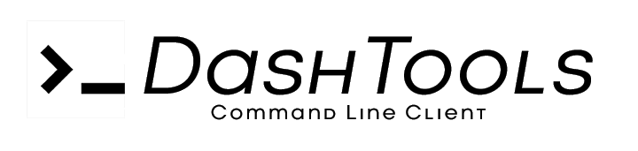

|GitHub| |PyPi| |Downloads| |Build And Test| |License|

DashTools is an open-source command line toolchain for `Plotly Dash <https://dash.plotly.com/introduction>`_ that makes creating and deploying dash projects to `Heroku <https://heroku.com/>`_ intuitive and easy.

Key Features
--------------
1. Deploy your app to Heroku with one command
2. Generate Procfile, requirements.txt and runtime.txt automatically on deploy
3. Create boilerplate dash apps with one command
4. Choose from many different boilerplate templates for creating apps

Pages
-------

.. toctree::
    :maxdepth: 1

    getting started
    features/index

.. toctree::
    :caption: Development
    :maxdepth: 1

    changelog
    contributing
    license

.. |GitHub| image:: https://img.shields.io/github/stars/andrew-hossack/dash-tools?style=flat-square
    :alt: GitHub Stars
    :scale: 100%
    :target: https://github.com/andrew-hossack/dash-tools

.. |PyPi| image:: https://img.shields.io/pypi/v/dash-tools?style=flat-square
    :alt: PyPi
    :scale: 100%
    :target: https://pypi.org/project/dash-tools/

.. |Downloads| image:: https://pepy.tech/badge/dash-tools
    :alt: Download Count
    :scale: 100%
    :target: https://pepy.tech/project/dash-tools

.. |Build And Test| image:: https://img.shields.io/github/workflow/status/andrew-hossack/dash-tools/Build%20and%20Test%20on%20Push%20or%20PR?label=Build%20and%20Test
    :alt: Build Passing
    :scale: 100%
    :target: https://img.shields.io/github/workflow/status/andrew-hossack/dash-tools/Build%20and%20Test%20on%20Push%20or%20PR?label=Build%20and%20Test

.. |License| image:: https://img.shields.io/github/license/andrew-hossack/dash-tools
    :alt: MIT License
    :scale: 100%
    :target: https://img.shields.io/github/license/andrew-hossack/dash-tools
